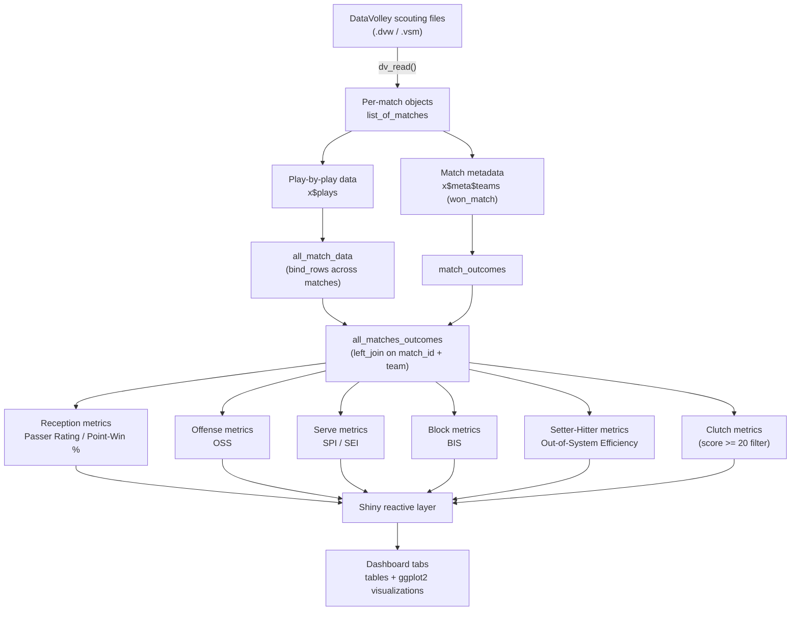

# Volleymetrics — Spring 2026

Advanced volleyball analytics pipeline and interactive dashboard built by **Bruin Sports Analytics** in collaboration with **UCLA Athletics** (Volleyball).

## Overview

Volleymetrics ingests play-by-play match data captured with DataVolley scouting software and turns it into advanced, actionable statistics for coaching staff and analysts. The pipeline reads raw scouting files, stitches them into a season-long play-by-play dataset, derives a set of custom advanced metrics (passer rating, offensive strength, serve efficiency, block influence, clutch performance, and more), and surfaces all of it through an interactive R Shiny dashboard.

## Data

Match files are not included in this repository.

- **Source format:** [DataVolley](https://www.dataproject.com/) scouting files (`.dvw` / `.vsm`), read into R via `datavolley::dv_read()`.
- **Granularity:** Rally-by-rally, skill-by-skill play data — one row per touch (serve, reception, set, attack, block, dig) — with columns such as `player_number`, `player_name`, `team`, `skill`, `skill_subtype`, `evaluation_code`, `evaluation`, `point_won_by`, `start_zone`, `num_players_numeric`, `phase`, `home_team_score` / `visiting_team_score`, and match/set identifiers.
- **Coverage:** Roughly 100 matches spanning the 2025 season, including:
  - UCLA women's volleyball matches (Sept–Dec 2025) against opponents such as CSULB, TCU, Pepperdine, UTEP, Texas Southern, USC, Oregon, Stanford, Purdue, Ohio State, Penn State, Minnesota, Wisconsin, Nebraska, Northwestern, Maryland, Illinois, Michigan, Rutgers, Kentucky, Georgia Tech, and Indiana.
  - Additional NCAA Division I matches scouted/logged by team analysts (credited in filenames: Beck Zimmerman, Anika Malapati, Ethan Rome, Grace Palumbo, Brandon Wong), covering programs including Michigan State, Iowa, Penn State, Wisconsin, Nebraska, Ohio State, Rutgers, Minnesota, Illinois, Michigan, Stanford, Oregon, Purdue, USC, Maryland, Indiana, and others, used to build a larger, more generalizable comparison dataset.
- **Derived dataset:** All match files are batch-loaded and combined into a single season-long table (`all_matches_outcomes`), joining play-by-play data with match outcomes (`won_match`). This combined table is the input to every downstream metric.

## Features

### Reception / Passing

- Passer rating (0–4 scale) by player and by serve-reception zone (Overhand / Low)
- Team-level average pass rating, split by win vs. loss
- Point-win probability conditioned on pass rating

### Offense

- Custom **Offensive Strength Stat (OSS)** — blends attack outcome, number of blockers faced, and phase (reception vs. transition) into a single per-player rating
- **Out-of-System Efficiency** — hitting efficiency broken down by setter → hitter combination

### Serving

- **Serve Performance Index (SPI)** and **Serve Efficiency Index (SEI)** — weighted composites of ace rate, error rate, opponent out-of-system rate, and point-win rate
- Breakdowns by player, team, serve zone, and serve type (Float / Jump / Jump-Float)
- Serve-type quadrant chart (error % vs. opponent out-of-system %) to classify serving styles

### Blocking

- **Block Influence Score (BIS)** — weighted score for kills, touches, and errors
- Blocking efficiency, touch rate, and blocks/set by player and by team
- Opponent hitting % with vs. without a block touch present in the rally

### Clutch / Pressure Situations

Rallies where either team has reached 20+ points:

- Clutch serving, clutch reception, and clutch offense leaderboards
- Combined **Clutch Index** blending hitting efficiency, side-out %, and serve point-scoring %

### Interactive Dashboard

- Multi-tab R Shiny app (`bslib` navbar UI) with team/player filters
- Leaderboards and team reports rendered as sortable tables
- `ggplot2` visualizations (bar charts, quadrant scatter plots) for serve and blocking trends

## Tech Stack

| Layer | Tools |
| --- | --- |
| Language | R |
| Data ingestion | [`datavolley`](https://github.com/openvolley/datavolley) (DataVolley `.dvw`/`.vsm` parser) |
| Data wrangling | `tidyverse`, `dplyr` |
| Visualization | `ggplot2` |
| Dashboard | `shiny`, `bslib` |
| Match data format | DataVolley scouting files (`.dvw`, `.vsm`) |

## Project Structure

```text
Volleymetrics-Spring-2026/
├── README.md
├── LICENSE
├── analysis/
│   └── Volley Group Test Code.qmd   # Exploratory Quarto notebook — metric prototyping
├── data/
│   ├── raw/                         # Raw DataVolley files (.dvw / .vsm) — not tracked in git
│   └── processed/                   # Cached exports (e.g. all_matches_outcomes.csv)
├── R/
│   ├── ingest.R                     # dv_read() wrappers + batch match loading
│   ├── metrics_reception.R          # Passer rating, point-win-by-pass
│   ├── metrics_offense.R            # Offensive Strength Stat (OSS)
│   ├── metrics_setter.R             # Out-of-system / setter-hitter efficiency
│   ├── metrics_serve.R              # SPI / SEI
│   ├── metrics_block.R              # Block Influence Score (BIS)
│   └── metrics_clutch.R             # Pressure-situation metrics
└── app/
    ├── app.R                        # Shiny dashboard (ui + server)
    └── www/                         # Static assets (CSS, logos)
```

## System Prerequisites

- [R](https://www.r-project.org/) (≥ 4.2)
- [RStudio](https://posit.co/products/open-source/rstudio/) or [Positron](https://positron.posit.co/) (recommended)
- [Quarto CLI](https://quarto.org/docs/get-started/) — to render the `.qmd` notebook
- A TeX distribution (e.g. [TinyTeX](https://yihui.org/tinytex/)) if rendering the notebook to PDF
- DataVolley `.dvw` / `.vsm` match files (not included — supply your own scouting exports)

## R Package Installation

```r
install.packages(c("tidyverse", "dplyr", "shiny", "bslib", "ggplot2", "remotes"))

# datavolley is distributed via GitHub, not CRAN
remotes::install_github("openvolley/datavolley")
```

## Data Flow



## Future Work

1. **Externalize data ingestion** — replace hardcoded absolute file paths and filename vectors with a config file or a `data/raw/` directory scan, so new matches can be added without editing code.
2. **Modularize the codebase** — extract the metric logic from the single Quarto notebook into reusable R functions/scripts (as sketched in the `R/` structure above) shared between the notebook and the Shiny app.
3. **Automate roster management** — pull player/team lists dynamically from the data instead of hardcoded player name vectors.
4. **Add automated tests** — unit tests (`testthat`) for each rating function (passer rating, OSS, SPI/SEI, BIS) to guard against regressions as evaluation-code mappings evolve.
5. **Improve missing-data handling** — audit `NA` propagation from unmapped `evaluation_code` values and decide on explicit handling rather than silent drops.
6. **Expand statistical coverage** — add digging, serve-receive formation analysis, and rotation-based/lineup analytics.
7. **Add season-over-season and match-level drill-down** — currently most views aggregate across the whole season; per-match and multi-season trend views would add coaching value.
8. **Deploy the dashboard** — publish to shinyapps.io or Posit Connect so coaching staff can access it without running R locally.
9. **Add access control** — gate the deployed dashboard given the sensitivity of opponent scouting data.
10. **Sync with video** — leverage DataVolley's video-timestamp linking to jump from a stat leaderboard directly to the corresponding video clip.

## License

© 2025–2026 Bruin Sports Analytics Volleyball and UCLA Athletics. All rights reserved.

This work is the property of Bruin Sports Analytics Volleyball, developed in partnership with UCLA Athletics. It is intended for internal use by UCLA Volleyball coaching staff and Bruin Sports Analytics members. Redistribution, publication, or use outside of these organizations requires prior written permission from Bruin Sports Analytics Volleyball and UCLA Athletics.
